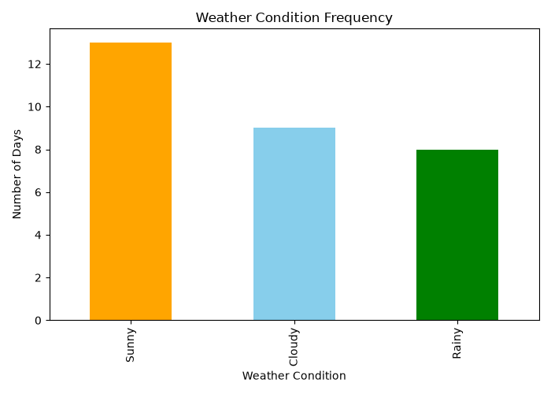
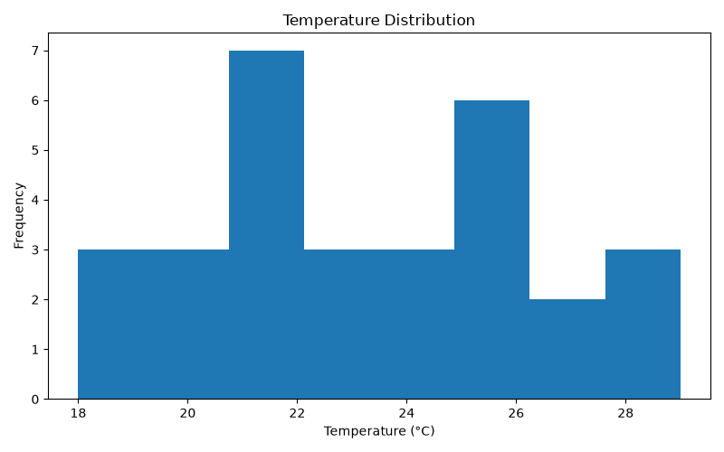
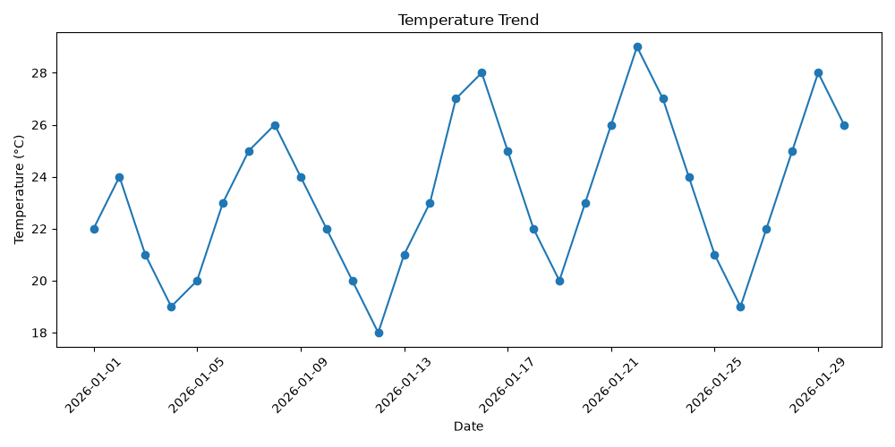
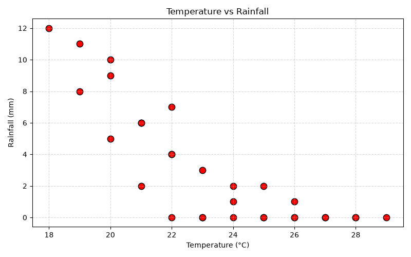
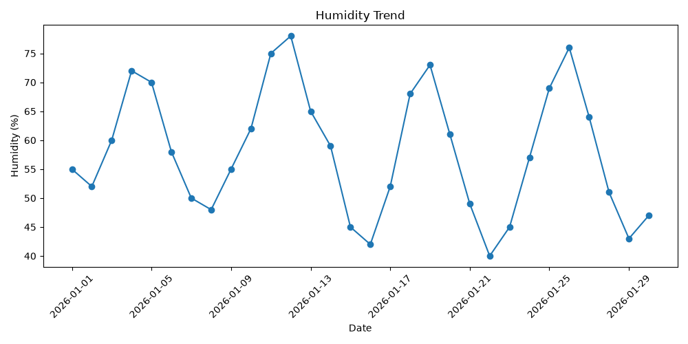
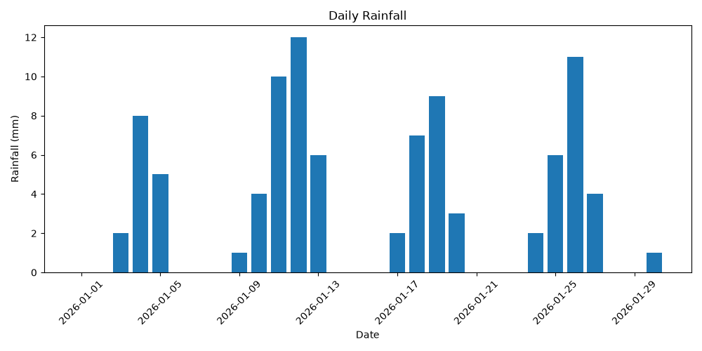
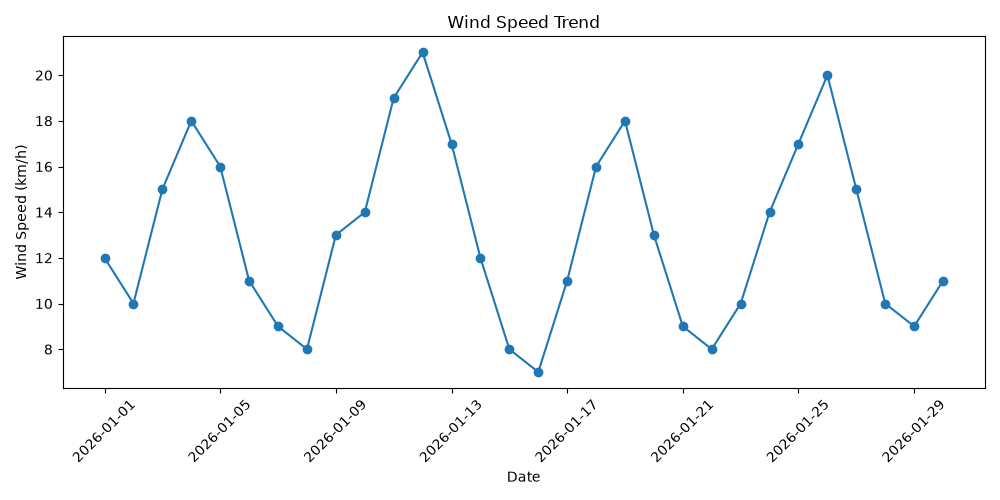

# Weather Condition Analysis 🌤️📊

A comprehensive Data Analysis project built with Python to analyze weather patterns, temperature trends, rainfall distribution, and humidity conditions.

## 🚀 Features
- **Temperature Distribution & Trend Analysis:** Visualizes historical temperature changes and density.
- **Rainfall vs. Temperature Correlation:** Analyzes environmental factors affecting local weather.
- **Automated Plotting:** Generates and saves visual graphs automatically inside the `graphs/` folder.

## 📌 Executive Summary
This project analyzes key weather variables including temperature, humidity, rainfall, and wind speed. By evaluating these parameters, the project aims to identify seasonal trends, climatic anomalies, and correlations between atmospheric indicators.

---

## 📊 Visualizations & Overview

### 1. Weather Condition Distribution

* **Overview:** Displays the frequency and count of different weather conditions recorded in the dataset, identifying dominant local weather patterns.

### 2. Temperature Distribution

* **Overview:** Illustrates the spread and frequency of temperature values, helping pinpoint normal ranges versus extreme variations.

### 3. Temperature Trend

* **Overview:** Highlights continuous temperature fluctuations over the timeline, capturing clear seasonal peaks and drops.

### 4. Temp vs Rainfall

* **Overview:** Explores the relationship between temperature changes and precipitation events to identify potential weather triggers.

### 5. Humidity

* **Overview:** Represents humidity variations across the dataset to assess atmospheric moisture concentration.

### 6. Rainfall

* **Overview:** Visualizes precipitation amounts and distribution patterns over the given observational period.

### 7. Wind Speed

* **Overview:** Tracks variations in wind speed to identify windy periods and calm atmospheric phases.

---

## 💡 Key Findings
* **Temperature Stability:** The temperature distribution exhibits a steady central tendency with occasional high-temperature peaks during specific periods.
* **Precipitation Correlation:** Rainfall shows noticeable clustering around specific temperature intervals, indicating conditional weather activity.
* **Environmental Interdependence:** High humidity levels frequently coincide with increased rainfall indicators and reduced temperature spikes.

## 🏁 Conclusion
The **Weather Condition Analysis** project successfully automates the extraction of key meteorology insights through data visualization. The visual models clearly map environmental trends and variable dependencies, serving as a reliable foundation for predictive forecasting or further climate data studies.

---

## 📁 Repository Structure